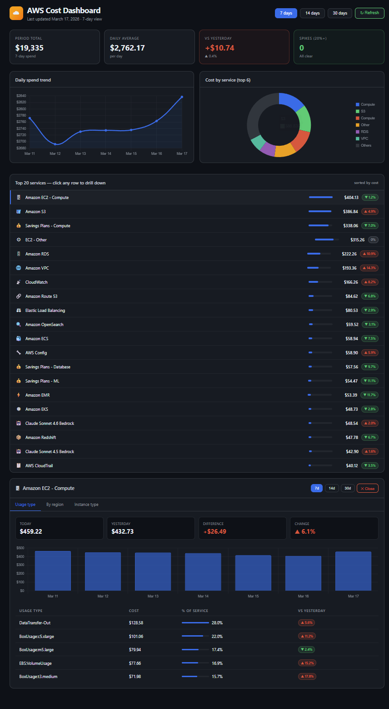

# AWS Cost Report Website

Interactive AWS cost dashboard built with vanilla JS, Chart.js, and AWS services.

## Features
- Top 20 services by cost with daily comparison
- Drill-down into each service by usage type, region, and instance type
- 7 / 14 / 30 day range selector
- Cost spike alerts
- Daily trend line and donut chart
- Powered by AWS Cost Explorer API

## Tech stack
- Frontend: HTML + CSS + Chart.js (hosted on S3 + CloudFront)
- Backend: AWS Lambda + API Gateway
- Data: AWS Cost Explorer API

## Live demo
https://d1b9nzcacdi8ql.cloudfront.net

## Setup
1. Deploy `api/lambda_function.py` as a Lambda function
2. Create an API Gateway REST API pointing to the Lambda
3. Replace `YOUR_API_URL_HERE` in `index.html` with your API Gateway URL
4. Upload `index.html` to an S3 bucket with static website hosting enabled
5. Put CloudFront in front for HTTPS

## Related
- [aws-cost-report](https://github.com/mattktam/aws-cost-report) — the daily email report this dashboard is based on

## Sample 

